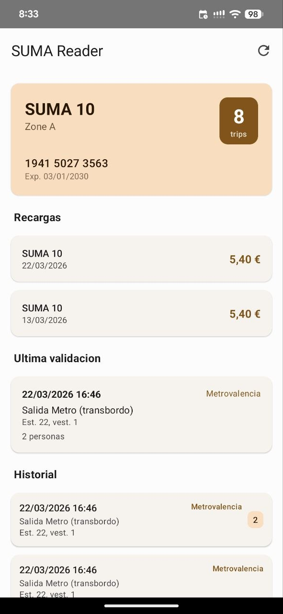

# SumaReader

Android app that reads and parses SUMA transit cards (Mifare Classic) via NFC.

Displays card holder info, balance, trip history, and ticket type extracted from the card's memory sectors.

Based on reverse engineering of the [RecargaSuma](https://play.google.com/store/apps/details?id=com.transermobile.recargasuma&hl=es) app.



## Requirements

- Android 10+ (API 29)
- Device with NFC and Mifare Classic support

## Build

```
./gradlew assembleDebug
```

APK output: `app/build/outputs/apk/debug/app-debug.apk`

## Install

```
adb install app/build/outputs/apk/debug/app-debug.apk
```
